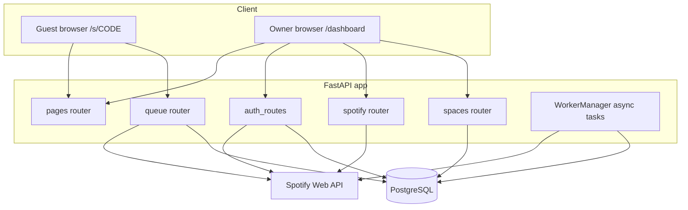
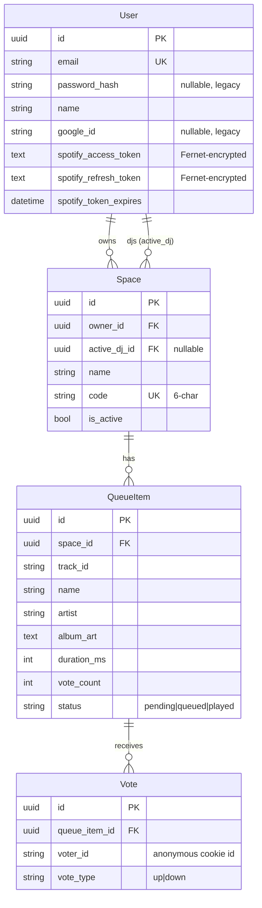

# Architecture — Social Jukebox

> Source-of-truth technical reference for the codebase. Keep this in sync with every change (see [AGENTS.md](AGENTS.md) → "Documentation maintenance protocol").

## 1. What it is

Social Jukebox lets a **host** link their Spotify (Premium) account and open a **Music Space**. **Guests** scan a QR code, land on a no-login page, search the Spotify catalog, add tracks, and up/down-vote them. A background worker watches the host's live playback and, whenever the current song changes, pushes the **top-voted pending track** into Spotify's real playback queue.

## 2. Tech stack

| Layer | Choice |
|-------|--------|
| Web framework | FastAPI (ASGI, `uvicorn`) |
| Language | Python 3.11.9 |
| ORM / DB driver | SQLAlchemy 2.0 async + `asyncpg` |
| Database | PostgreSQL (Supabase in prod) |
| Music API | Spotify Web API via `spotipy` |
| Auth | Spotify OAuth → app-issued JWT (`python-jose`) |
| Token encryption | `cryptography` Fernet (key derived from `SECRET_KEY`) |
| Frontend | Jinja2 templates + vanilla JS + Tailwind (CDN) |
| QR codes | `qrcode[pil]` |
| Deploy | Render (`render.yaml` blueprint) |

## 3. Runtime topology



## 4. Application layout

```
app/
  main.py            FastAPI app, lifespan (init_db + restart workers), CORS, router registration
  config.py          pydantic-settings Settings (env-driven), lru_cache get_settings()
  database.py        async engine, sessionmaker, Base, get_db dep, init_db + inline migrations
  models.py          ORM: User, Space, QueueItem, Vote
  schemas.py         Pydantic request/response models
  auth.py            password hashing (legacy), JWT create/decode, get_current_user dependency
  worker.py          WorkerManager singleton + per-space polling loop
  routers/
    pages.py         HTML page serving (landing, dashboard, space)
    auth_routes.py   Spotify OAuth login/signup, /me, DJ-claim callback handling
    spotify.py       Spotify token encrypt/decrypt, client factory, playback controls
    spaces.py        Space CRUD, activate/deactivate, QR, DJ claim/release
    queue.py         Guest search, add, vote, downvote, recommendations, queue state
  templates/
    landing.html     Public homepage + Spotify auth modal
    dashboard.html   Owner dashboard + "master view" live control
    space.html       Guest voting interface
```

## 5. Data model



Constraints:
- `QueueItem`: unique `(space_id, track_id, status)` — prevents duplicate pending tracks.
- `Vote`: unique `(queue_item_id, voter_id)` — one vote per anonymous voter per item.

## 6. Key flows

### 6.1 Host auth (Spotify-only)
1. Landing page → "Continue with Spotify" → `GET /api/auth/spotify/login` returns Spotify OAuth URL.
2. Spotify redirects to `GET /api/auth/spotify/callback` (`spotify_login_redirect_uri`).
3. App fetches the Spotify profile, upserts a `User` by email, encrypts + stores tokens, issues a JWT.
4. Redirect to `/dashboard?token=...`; the frontend stores the JWT in `localStorage`.

> Google OAuth and email/password login were removed. `password_hash` / `google_id` columns and `auth.py` password helpers remain but are unused.

### 6.2 Space lifecycle
- `POST /api/spaces` (auth) — requires linked Spotify; generates a unique 6-char code.
- `PATCH /api/spaces/{code}/activate` — sets `is_active`, `active_dj_id = owner`, starts a worker.
- `PATCH /api/spaces/{code}/deactivate` — stops worker, clears pending/queued items + their votes.
- `DELETE /api/spaces/{code}` — stops worker, cascade-deletes the space.
- `GET /api/spaces/{code}/qr` — streams a PNG QR pointing to `/s/{code}`.

### 6.3 DJ claim (guest-initiated hosting)
- `GET /api/spaces/{code}/claim-dj` → Spotify OAuth with `state=dj:{code}`.
- Callback (`auth_routes.spotify_login_callback`) detects `dj:` state, sets `active_dj_id`, activates the space, starts the worker, and redirects to `/s/{code}`.
- `POST /api/spaces/{code}/release-dj` — owner or active DJ releases the role and clears the queue.

The **active DJ (or owner fallback)** provides the Spotify credentials used for search, recommendations, and playback for that space.

### 6.4 Guest voting (no auth)
- `GET /api/spaces/{code}/search?q=` — searches via the DJ's Spotify client.
- `POST /api/spaces/{code}/add` — adds a pending `QueueItem` (max 50/space), records the initial upvote, sets a `voter_id` cookie.
- `POST /api/spaces/{code}/vote` / `POST .../downvote` — toggle logic on `Vote.vote_type`, adjusts `vote_count`.
- `GET /api/spaces/{code}/queue` — returns now-playing (live from Spotify), the locked-in "up next", the sorted pending queue, and a filtered view of Spotify's own upcoming queue.

### 6.5 Background worker
`WorkerManager` (singleton in `worker.py`) keeps a `dict[space_id -> asyncio.Task]`.
- On startup, `restart_active_workers()` relaunches a loop for every active space.
- Each `_poll_loop` sleeps 5s, then `_check_and_queue`:
  1. Loads the DJ user + fresh Spotify client (refreshing/persisting tokens if expired).
  2. Reads `current_playback()`.
  3. On **track change**, marks matching `queued` items as `played` and resets the "already queued" flag.
  4. If nothing queued for the current song yet, takes the top-voted `pending` item, calls `add_to_queue`, and flips its status to `queued`.

## 7. Spotify token handling
- Tokens are Fernet-encrypted at rest. The Fernet key is `base64(sha256(SECRET_KEY))` — **rotating `SECRET_KEY` invalidates all stored Spotify tokens.**
- `get_spotify_client(user)` decrypts, checks expiry, and on refresh attaches `user._refreshed_token` for the caller to persist. `get_spotify_client_for_user(user, db)` wraps this and commits the refreshed token.
- Scopes: `user-modify-playback-state user-read-playback-state user-read-currently-playing user-top-read` (+ `user-read-email user-read-private` for login/DJ-claim).

## 8. Database migrations
There is **no Alembic**. `init_db()` runs `Base.metadata.create_all` then idempotent `ALTER TABLE ... ADD COLUMN IF NOT EXISTS` statements for columns added after the initial schema (`votes.vote_type`, `spaces.active_dj_id`). New columns on existing tables must be added the same way here.

## 9. Configuration (env vars)
Defined in `config.py`; see `.env.example`.

| Var | Purpose |
|-----|---------|
| `DATABASE_URL` | `postgresql+asyncpg://...` connection string |
| `SPOTIFY_CLIENT_ID` / `SPOTIFY_CLIENT_SECRET` | Spotify app credentials |
| `SPOTIFY_REDIRECT_URI` | Spotify "link account" callback |
| `SPOTIFY_LOGIN_REDIRECT_URI` | Spotify login/DJ-claim callback (**not yet in `.env.example` / `render.yaml`**) |
| `SECRET_KEY` | JWT signing + Fernet key derivation |
| `APP_URL` | Base URL for redirects and QR links |
| `APP_NAME` | Display name |

## 10. Known gaps / tech debt
- `README.md` still documents removed endpoints (email/password signup/login, Google OAuth).
- `SPOTIFY_LOGIN_REDIRECT_URI` is required by the code but missing from `.env.example` and `render.yaml`.
- No automated tests.
- CORS is `allow_origins=["*"]` (intentional for MVP guests; revisit for prod).
- The recommendations endpoint relies on Spotify's `recommendations`/`artist_related_artists` endpoints, which Spotify has deprecated for newer apps — has layered fallbacks but may return empty.
- Legacy `password_hash` / `google_id` columns and `auth.py` password helpers are dead code.
